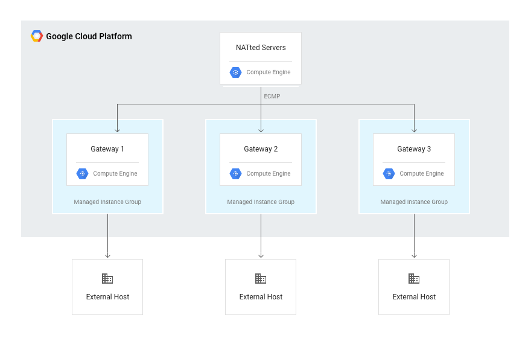

# networking

## Requirements

You will need:
* `gcloud` command tool

## Demos

### run.sh

Creates a VPC network and subnet with firewall rules.

## Topics

### Building High Availability and High Bandwidth NAT Gateways

## Notes

The following roles are used in conjunction with single-project networking to independently control administrative access to each VPC Network:
* Network Admin: Permissions to create, modify, and delete networking resources, except for firewall rules and SSL certificates.
* Security Admin: Permissions to create, modify, and delete firewall rules and SSL certificates.

## References

* [VPC Network Peering](https://cloud.google.com/vpc/docs/vpc-peering)
** Google Cloud Platform (GCP) Virtual Private Cloud (VPC) Network Peering allows private RFC 1918 connectivity across two VPC networks regardless of whether or not they belong to the same project or the same organization.
** VPC Network Peering allows you to build SaaS (Software-as-a-Service) ecosystems in GCP, making services available privately across different VPC networks within and across organizations, allowing workloads to communicate in private RFC 1918 space.
VPC Network Peering is useful for:
Organizations with several network administrative domains.
Organizations that want to peer with other organizations.
** [VM Instance as a NAT Gateway](https://cloud.google.com/vpc/docs/special-configurations#natgateway)
